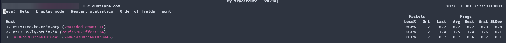
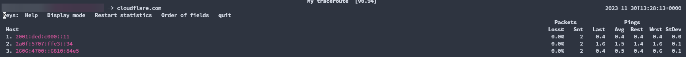

## 什麼是 MTR？

MTR (My Traceroute) 是一個強大的 Linux 網路診斷工具，它巧妙地結合了 `ping` 和 `traceroute` 兩大工具的優點。與傳統的 traceroute 只執行一次路由追蹤不同，MTR 會持續監控網路中的每一個路由節點和每一跳 (hop)，提供即時的網路品質數據，幫助您快速診斷網路問題、分析封包遺失和延遲狀況。

對於網路管理員和系統工程師來說，MTR 是進行網路故障排除的必備工具，能夠清楚呈現從源頭到目標主機之間所有節點的連線狀態。

印象中好像有看過 WinMTR 之類的酷東東（Windows 版本）

~~不是NTR，我第一次聽到這工具的時候聽成ntr~~

~~我還試著apt-get install ntr -y~~

## MTR 安裝教學（Ubuntu/Debian）

在 Ubuntu 或 Debian 系統上安裝 MTR 非常簡單，只需要一行指令：

```bash
apt-get install mtr -y
```

安裝完成後，就可以立即開始使用 MTR 進行網路診斷了。

## MTR 基礎使用方法與指令範例

### 最簡單的用法

執行 MTR 最基本的方式就是直接指定目標 IP 或網域：

```bash
$ mtr 1.1.1.1
```

執行後，您會看到類似下方的輸出畫面。MTR 會即時顯示路由路徑、封包遺失率 (Loss%)、已傳送封包數 (Snt)、最後一次延遲 (Last)、平均延遲 (Avg)、最佳延遲 (Best)、最差延遲 (Wrst) 等詳細的網路診斷資訊。


### 指定 IPv4 或 IPv6 協定

您可以使用 `-4` 或 `-6` 參數來強制 MTR 使用特定的 IP 協定版本：

```bash
# 強制使用 IPv4
mtr 1.1.1.1 -4

# 強制使用 IPv6
mtr cloudflare.com -6
```


### 同時顯示網域名稱與 IP 位址

使用 `-b` 參數可以讓 MTR 同時顯示每個節點的網域名稱和 IP 位址，方便識別路由經過的網路設備：

```bash
mtr cloudflare.com -b
```



### 僅顯示 IP 位址（不解析網域名稱）

如果您想要加快 MTR 的執行速度，或是只想看 IP 位址，可以使用 `-n` 參數跳過 DNS 反向解析：

```bash
mtr -n cloudflare.com
```



### 設定 Ping 次數上限

使用 `-c` 參數可以限制 MTR 的 ping 測試次數。當 `Snt` 欄位達到指定數字後，MTR 會自動結束並顯示統計結果：

```bash
mtr 1.1.1.1 -c 6
```

這個參數在需要快速測試或自動化腳本中特別有用。

### MTR 結果匯出與報告生成

#### 將結果匯出為文字檔

有時候我們需要將 MTR 的測試結果保存下來，用於報告撰寫、與同事分享或是向老闆呈現網路狀況（或是炫耀直連 Google 的低延遲！）。

使用 `-r` 參數配合輸出重導向，就能將結果儲存為文字檔：

```bash
mtr 1.1.1.1 -r > owo.txt -c 6
```

上述指令的意思是：
- 追蹤到 `1.1.1.1` 的路由
- 使用報告模式 (`-r`)
- 輸出到當前目錄下的 `owo.txt` 檔案
- 限制測試 6 次後自動結束 (`-c 6`)

匯出後的 `owo.txt` 內容範例如下：


### 使用 TCP 或 UDP 協定進行測試

預設情況下，MTR 使用 ICMP 封包進行測試。但某些網路環境可能會封鎖 ICMP，此時您可以改用 TCP 或 UDP 協定：

```bash
# 使用 TCP 協定
mtr 1.1.1.1 --tcp

# 使用 UDP 協定
mtr 1.1.1.1 --udp
```

這在診斷防火牆問題或特定協定的網路路徑時非常有用。

### 指定來源 IP 位址

如果您的系統有多個網路介面或 IP 位址，可以使用 `-a` 參數指定從哪個 IP 發送測試封包：

```bash
mtr -a <來源IP> 目標主機
```

## MTR 使用技巧總結

MTR 是網路診斷的瑞士刀，結合了 ping 的持續監控和 traceroute 的路由追蹤功能。掌握 MTR 能讓您：

- **快速定位網路問題**：清楚看到哪個節點出現封包遺失或高延遲
- **持續監控網路品質**：即時觀察網路狀態變化
- **生成專業報告**：匯出詳細數據供分析或呈報

### 何時使用 MTR？

- 網站或服務出現間歇性連線問題
- 需要追蹤網路封包的完整路徑
- 診斷特定節點的網路品質
- 比較不同時段的網路狀況

### MTR vs 其他工具

- **vs Ping**：MTR 提供完整路由路徑資訊，而不只是終點主機的延遲
- **vs Traceroute**：MTR 持續監控並提供統計數據，traceroute 只執行一次
- **vs Pathping (Windows)**：MTR 在 Linux 環境下更輕量且即時性更好

## 延伸閱讀

想了解更多關於 MTR 和網路診斷的知識嗎？推薦以下資源：

- [MTR：Linux 網路診斷工具使用教學](https://blog.gtwang.org/linux/mtr-linux-network-diagnostic-tool/)
- [Linux MTR 命令使用解释](https://blog.csdn.net/duxing_langzi/article/details/110278793)
