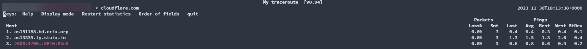
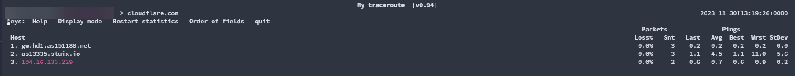
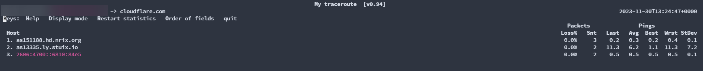
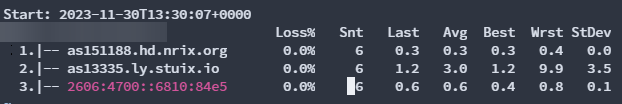

MTR是一個Linux網路診斷工具，其結合了ping跟traceroute二者的功能，並且不會像traceroute一樣只會做路由追蹤一次，MTR會持續的監控每一處路由節點跟每一跳

印象中好像有看過WinMTR之類的酷東東

~~不是NTR，我第一次聽到這工具的時候聽成ntr~~

~~我還試著apt-get install ntr -y~~

## 安裝

```
apt-get install mtr -y
```

## 基礎使用

```
$ mtr 1.1.1.1
```

以下是輸出，可以觀察到會顯示路由路徑還有掉包情況等等的詳細資訊



### 限定用v4 or v6

```
mtr 1.1.1.1 -4
#or
mtr cloudflare.com -6
```


### 同時顯示網域名稱跟IP

```
mtr cloudflare.com -b
```


### 以IP顯示節點

```
mtr -n cloudflare.com
```

### 設定ping次數上限

\-c 後面加上次數，snt那欄到達指定數字後就會自動關閉mtr

```
mtr 1.1.1.1 -c 6
```

### 匯出結果

有時候我們可能要跟老闆報告或是跟朋友炫耀直連Google

就需要截圖或是匯出表格

下面的意思是

追蹤到1.1.1.1的路由，輸出到同個目錄底下的一個叫owo的txt檔，限制次數是6次，六次之後自動結束

```
mtr 1.1.1.1  -r > owo.txt -c 6
```

下面是owo.txt的內容



### TCP&UDP

這個可以把ICMP封包換成TCP或是UDP

```
mtr 1.1.1.1 --tcp
#or 
mtr 1.1.1.1 --udp
```

我要先去睡覺，有空再繼續打完:P -台灣 (GMT+8)星期四, 2023年11月2日, 凌晨2:18

### 參考資料

[MTR：Linux 網路診斷工具使用教學](https://blog.gtwang.org/linux/mtr-linux-network-diagnostic-tool/)

[Linux MTR 命令使用解释](https://blog.csdn.net/duxing_langzi/article/details/110278793)
